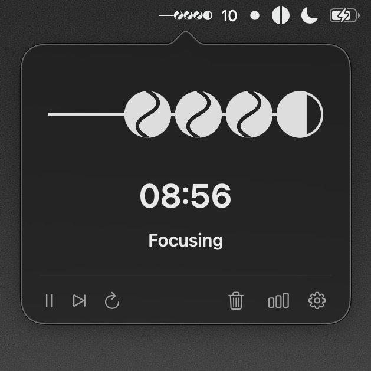
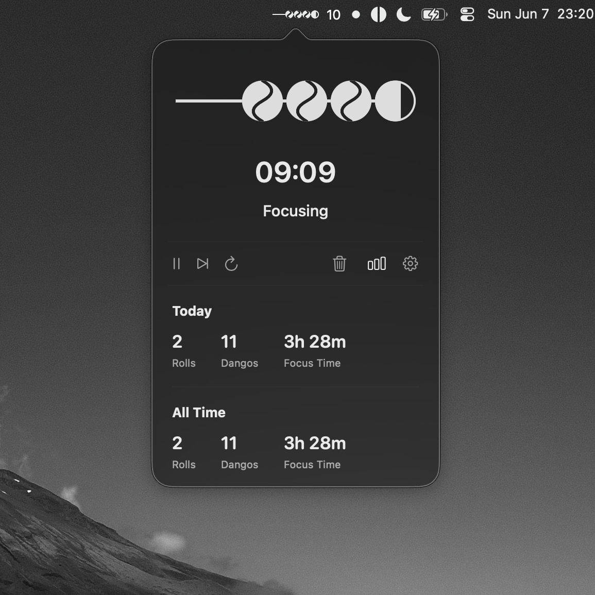
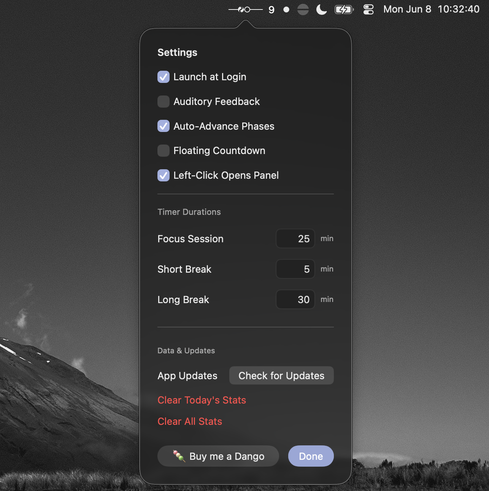
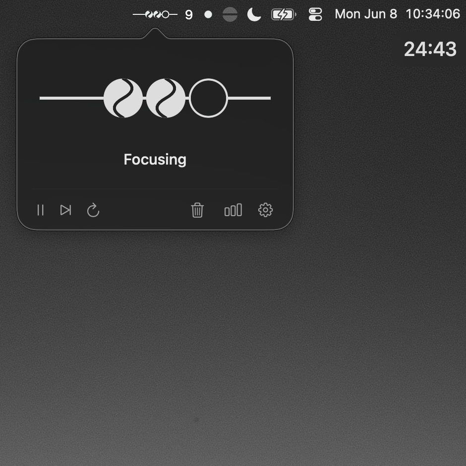

# Dango

Menu bar pomodoro timer.

Each focus session fills a dango. Each rest adds glazing. Four sessions finish a roll.

No bloat, no clutter. Native SwiftUI design. Information you can read at a glance, and it does all that while looking pretty.

Dango lives in the menu bar. No Dock icon, no main window. The skewer is the menu bar icon, so you can see where you are in the cycle without opening anything.

## Screenshots

<table>
  <tr>
    <td width="50%"></td>
    <td width="50%"></td>
  </tr>
  <tr>
    <td width="50%"></td>
    <td width="50%"></td>
  </tr>
</table>

## Installation

Grab the latest release, open the DMG, drag Dango to Applications.

Dango ships outside the App Store. The build is ad-hoc signed, not notarized, and macOS Gatekeeper blocks the first launch. This is normal.

1. Double-click Dango, macOS warns the developer is unverified. Click OK.
2. Open System Settings → Privacy & Security. Under Security, click Open Anyway, then Open.
3. Or right-click Dango, choose Open, then Open, macOS remembers your choice after the first launch.

## Settings

Open the panel from the menu bar icon, then tap the gear.

**Launch at Login.** Start Dango when you log in.

**Auditory Feedback.** Chime when a phase ends.

**Auto-Advance Phases.** Move to the next phase without tapping start.

**Floating Countdown.** Small HUD with time left. Stays out of the way and does not steal focus.

**Left-Click Opens Panel.** Off by default. Left-click toggles the timer. Right-click opens the panel.

**Timer Durations.** Set focus session, short break, and long break length in minutes (1 to 180 each).

**Check for Updates.** Manual check against releases. No background polling.

**Clear Today's Stats** and **Clear All Stats.** Wipe roll and focus counts. Both ask before they run.

Stats (rolls, dangos, focus time) sit in the panel below the timer. The timer uses wall-clock time, so it stays accurate across sleep and wake. If the app quits mid-session, it picks up where you left off.

## Requirements

macOS 14 (Sonoma) or later.

## Build from source

```bash
swift build -c release
swift run
```

For Xcode, generate the project with [XcodeGen](https://github.com/yonaskolb/XcodeGen):

```bash
xcodegen generate
open Dango.xcodeproj
```

Package a DMG:

```bash
./Scripts/package_dmg.sh ~/Downloads/Dango_Installer.dmg
```

The generated `Dango.xcodeproj` is untracked. `project.yml` is the source of truth.

## Support

This app is free and open source, and always will be. If it's made your focus a little sweeter, you can [buy me a dango](https://buymeacoffee.com/sosjalapeno) as a thank-you. I'll put the funds toward shipping Dango to the App Store.

## License

Released under the [GNU General Public License v3.0](LICENSE).
